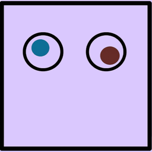
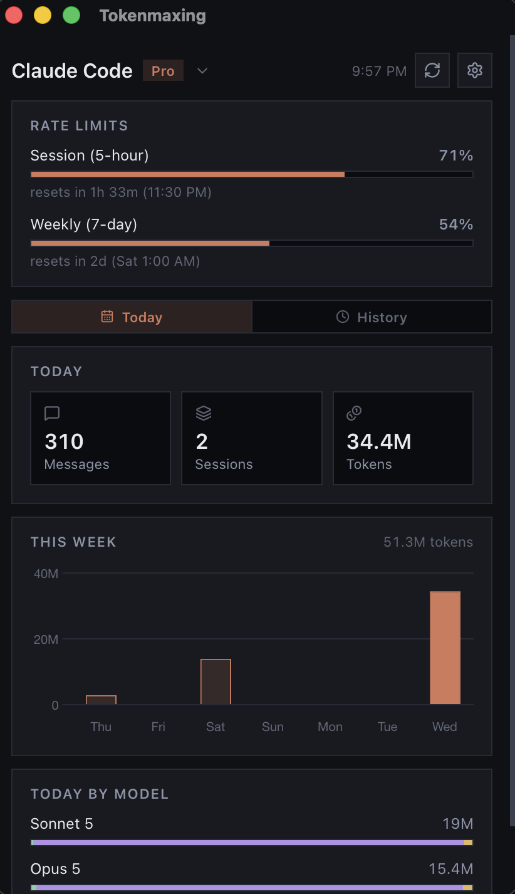

# Tokenmaxing




Menu bar widget for coding agent usage, built with Tauri, SvelteKit, Bun, and Iconify.

<br>


## What it shows

One agent at a time, picked from the dropdown on the title, toggled between a
Today view and a History view:

- Rate limits (Anthropic OAuth usage windows for Claude Code, app-server windows for Codex)

Today view:

- Today's messages, sessions, and tokens
- A compact 7 day token chart
- Today's token split per model across input, output, cache read, and cache write

History view:

- Token and message history in a Chart.js bar chart, toggle between a 7, 30,
  or 90 day range and between tokens or messages
- All-time token split per model across input, output, cache read, and cache write
- All-time messages, sessions, and active days

## Agents and sources

| Agent | Sources |
| --- | --- |
| Claude Code | Claude Code transcripts, pi and omp `anthropic` sessions, opencode `anthropic` messages |
| Codex | Codex CLI sessions, pi and omp `openai-codex` sessions, opencode `openai` messages |

| Source | Location |
| --- | --- |
| Claude Code transcripts | `~/.claude/projects/**/*.jsonl` |
| Aggregate fallback | `~/.claude/stats-cache.json`, `~/.claude/history.jsonl` |
| pi and omp sessions | `~/.pi/agent/sessions`, `~/.omp/agent/sessions` |
| opencode sessions | `$XDG_DATA_HOME/opencode/opencode.db` |
| Codex sessions | `$CODEX_HOME/sessions`, `$CODEX_HOME/archived_sessions` |
| Claude rate limits | `https://api.anthropic.com/api/oauth/usage` |
| Codex rate limits | `codex app-server` JSON-RPC |

Claude Code and Codex are both enabled by default. An agent stays in the
dropdown even when nothing is found for it, so its status is visible rather than
silent.

Gemini and Copilot appear in settings but have no reader yet, so their toggles
stay disabled until a sample session file is available.

Scan results are cached under `$XDG_CACHE_HOME/omarchy/tokenmaxing`.

Daily token and message totals are saved locally per agent under
`$XDG_CACHE_HOME/omarchy/tokenmaxing/history/<agentId>.json`, capped at 90
days, and back the token history chart independent of how far back the
underlying transcripts are still retained.

Claude credentials are read from `~/.claude/.credentials.json`, falling back to
the macOS Keychain item `Claude Code-credentials`.

## System tray

The app lives in the system tray.

| Action | Result |
| --- | --- |
| Left click the tray icon | Toggles the widget window |
| Right click the tray icon | Opens the tray menu |
| Show widget / Hide widget | Shows or hides the window |
| Refresh now | Forces a rescan and shows the window |
| Quit | Exits the app |

Closing the window hides it to the tray instead of quitting. On macOS the app
runs as an accessory (`LSUIElement`), so it has no dock icon and no menu bar of
its own; the tray icon is the only entry point.

## Settings

Settings live in `<config dir>/tokenmaxing/settings.json` and cover the theme
and which sources are scanned.

| Group | Themes |
| --- | --- |
| Modern | Modern Dark (default), Modern Light |
| Catppuccin | Mocha, Macchiato, Frappe, Latte |
| Popular | Nord, Gruvbox Dark, Tokyo Night |

## Install and build

Prerequisites:

- [Bun](https://bun.sh)
- [Rust](https://www.rust-lang.org/tools/install) (stable toolchain)

Install dependencies:

```
bun install
```

Run in development mode, with hot reload for the SvelteKit frontend:

```
bun run tauri dev
```

Build a release bundle (see [macOS distribution](#macos-distribution) below):

```
bun run tauri build
```

## macOS distribution

`bun run tauri build` produces `src-tauri/target/release/bundle/macos/Tokenmaxing.app`
and a `.dmg` alongside it.

Bundle settings live in `src-tauri/tauri.conf.json`:

| Setting | Value |
| --- | --- |
| Bundle identifier | `co.sirblob.tokenmaxing` |
| Category | `DeveloperTool` |
| Minimum system version | 10.15 |
| Signing identity | `-` (ad hoc) |

`src-tauri/Info.plist` sets `LSUIElement` so the bundled app starts without a
dock icon.

Ad hoc signing is enough to run the app locally, including on Apple silicon.
